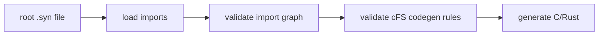
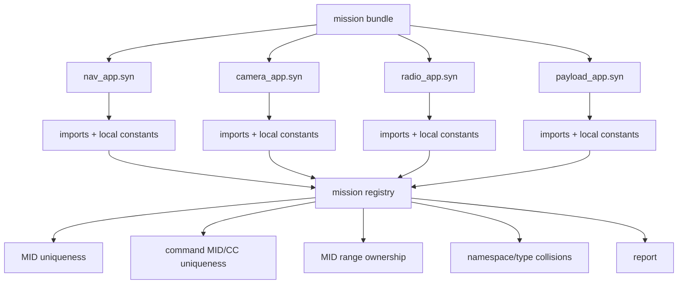

# Mission-Wide Validation

Synapse currently answers a file-local question:

> Can this `.syn` root, plus its imports, be generated safely for cFS C/Rust ABI code?

That is necessary, but it is not the whole mission problem. A cFS mission needs a stronger answer:

> Can all of these apps coexist safely on one Software Bus?

Mission-wide validation is the feature that moves Synapse from a useful code generator toward a mission message utility.

## Current Shape

Single-root generation starts from one `.syn` file, loads its imports, validates the graph, checks cFS codegen constraints, and emits C/Rust output.



This catches local problems:

- Missing imports.
- Unresolved type references.
- Unsupported ABI constructs.
- Missing `@mid(...)` or `@cc(...)`.
- Duplicate MIDs within one generated file.
- Duplicate command MID/CC pairs within one generated file.

A single-root run does not answer cross-app questions. For example, two independent roots can both be locally valid while still reusing the same telemetry MID.

## Mission Shape

Mission validation starts from multiple roots and builds a registry of every packet-like declaration that participates in the mission.



The key new concept is the **mission registry**.

## Mission Registry

The registry is an internal inventory of mission-visible message facts. It is not generated code and it is not a replacement for `.syn` files. It is the collected view Synapse needs in order to validate the mission as one system.

For each packet-like declaration, the registry records facts such as:

```text
telemetry nav_app::NavState
  source = mission/nav/nav_msgs.syn
  MID    = 0x0801

telemetry camera_app::CameraStatus
  source = mission/camera/camera_msgs.syn
  MID    = 0x0881

command camera_app::SetExposure
  source = mission/camera/camera_msgs.syn
  MID    = 0x1880
  CC     = 2
```

A more explicit registry entry might look like:

```text
PacketEntry {
    namespace: ["camera_app"],
    name: "SetExposure",
    kind: Command,
    source: "mission/camera/camera_msgs.syn",
    mid: 0x1880,
    cc: 2,
    mid_source: "camera_ids::CAMERA_CMD_MID",
    cc_source: "camera_ids::SET_EXPOSURE_CC",
}
```

The resolved numeric values are what enable validation. The source strings are what make diagnostics useful to humans.

The same registry could later be emitted as a machine-readable artifact, such as JSON, for tools that want to ingest packet definitions into a database, generate reports, publish ICDs, or build dashboards. That keeps Synapse focused: it produces and validates the message-contract data, while other tools can decide how to store, query, or present it.

## What It Catches

Duplicate telemetry MIDs:

```text
error: duplicate telemetry MID 0x0801
  first:  nav_app::NavState
          mission/nav/nav_msgs.syn
  second: payload_app::PayloadStatus
          mission/payload/payload_msgs.syn
```

Duplicate command MID/CC pairs:

```text
error: duplicate command MID/CC pair 0x1880/1
  first:  camera_app::SetMode
          mission/camera/camera_msgs.syn
  second: radio_app::SetMode
          mission/radio/radio_msgs.syn
```

Allowed shared command MID with distinct command codes:

```text
ok:
  camera_app::SetMode      MID 0x1880 CC 1
  camera_app::SetExposure  MID 0x1880 CC 2
```

Future policy checks could include reserved ranges:

```text
nav_app telemetry MIDs:    0x0800..0x083F
camera_app telemetry MIDs: 0x0880..0x08BF
radio_app command MIDs:    0x1900..0x193F
```

That would let Synapse catch a packet that is unique but owned by the wrong app range.

## Why This Matters

File-local validation makes one generated header safe.

Mission-wide validation makes a set of apps safe together.

That is the game-changing part for a cFS-focused message utility. It moves Synapse toward the role ROS 2 message packages play in a robot system: a central contract for messages, IDs, namespaces, and generated language bindings.

## User Interface

The implemented `0.2.x` interface extends `check` to accept multiple roots:

```bash
synapse check mission/nav/nav_msgs.syn mission/camera/camera_msgs.syn mission/radio/radio_msgs.syn
```

## Proposed Future Manifest

The following TOML shape is not implemented. It is a design candidate for a later mission manifest once Synapse supports range ownership and repeatable mission configuration:

```bash
synapse mission check mission.synapse.toml
```

Possible manifest shape:

```toml
[mission]
name = "demo"

roots = [
  "mission/nav/nav_msgs.syn",
  "mission/camera/camera_msgs.syn",
  "mission/radio/radio_msgs.syn",
]

[[ranges]]
namespace = "nav_app"
telemetry = "0x0800..0x083F"
command = "0x1800..0x183F"

[[ranges]]
namespace = "camera_app"
telemetry = "0x0880..0x08BF"
command = "0x1880..0x18BF"
```

For now, use multi-root `synapse check` as the supported mission validation interface.

## Possible Future Outputs

Synapse now provides static HTML documentation from the same validated roots:

```bash
synapse doc mission/nav/nav_msgs.syn mission/camera/camera_msgs.syn -o site/
```

That command generates human-readable static documentation from packet IDs, command codes, fields, types, namespaces, imports, and doc comments.

Synapse also provides machine-readable packet registry output:

```bash
synapse registry mission/nav/nav_msgs.syn mission/camera/camera_msgs.syn --format json
synapse registry mission/nav/nav_msgs.syn mission/camera/camera_msgs.syn --format csv -o packets.csv
```

That command produces a validated packet registry for downstream databases or automation.

See [`registry.md`](registry.md) for the current JSON and CSV schema.

Those outputs stay inside Synapse's intended boundary: define, generate, validate, and report message contracts. Database storage, web hosting, dashboards, and mission operations remain separate tools.

## Implementation Plan

1. **Collect roots**

   Accept multiple input roots for validation. Each root keeps the same direct-import visibility rules that path generation uses today.

2. **Load import closures**

   Load and validate each root's import graph. Reuse existing import graph logic where possible.

3. **Build the registry**

   Walk every root and imported unit that participates in the mission. Record command and telemetry declarations with resolved MID and CC values.

4. **Apply policies**

   Start with global duplicate checks:

   - Duplicate telemetry MIDs.
   - Duplicate command MID/CC pairs.
   - Command/telemetry MID bit-pattern mismatches.

5. **Report clearly**

   Diagnostics should name the packet, namespace, source path, MID/CC value, and the conflicting packet. The registry exists largely to make these reports precise.

## Open Design Questions

- Should imported dependency files contribute packet entries automatically, or should only explicit mission roots count as owned packet producers?
- Should mission validation allow two roots to import the same packet definition without reporting it twice?
- Should `command` MIDs be unique globally, or is sharing a command MID across apps acceptable when command codes differ?
- Should range ownership live in `.syn` syntax, a mission manifest, or both?
- Should generated packet constants eventually include namespace ownership the same way C enum variant macros do?

## First Useful Slice

The first useful implementation does not need manifests or ranges.

It is:

```bash
synapse check root_a.syn root_b.syn root_c.syn
```

It reports:

- All normal single-root validation errors.
- Duplicate telemetry MID values across the collected roots.
- Duplicate command MID/CC pairs across the collected roots.

That already makes Synapse much more valuable for real cFS mission integration.
